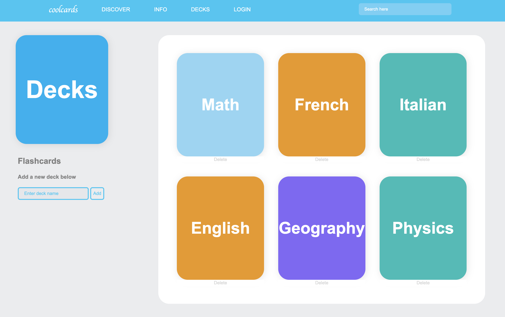
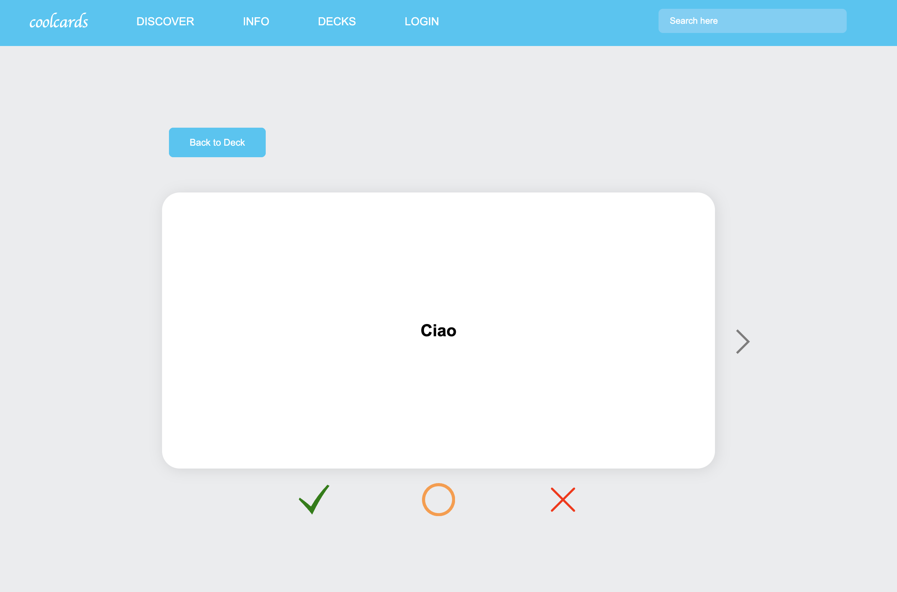
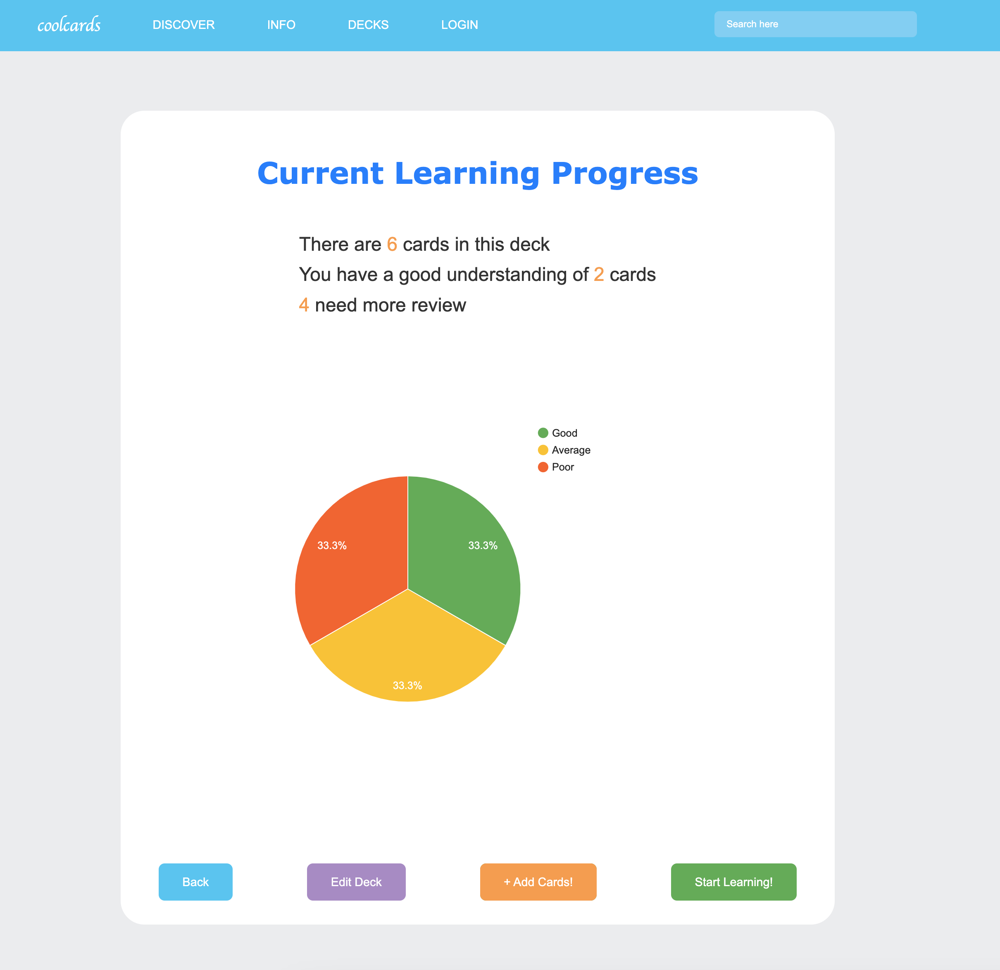

# Flashcard-App

Flash Card App is an enhanced learning platform that offers an enriched learning experience, fostering personalized learning and quizzes. 

Within the Flash Card App, users can create decks tailored to their interests, freely adding or removing cards as desired.

Furthermore, the app tracks users' learning journeys by capturing feedback on their familiarity with individual cards. It also provides summaries of learning progress for each deck, enabling users to monitor their advancement effectively.

**Landing Page**

**Learning Page**

**Summary**

